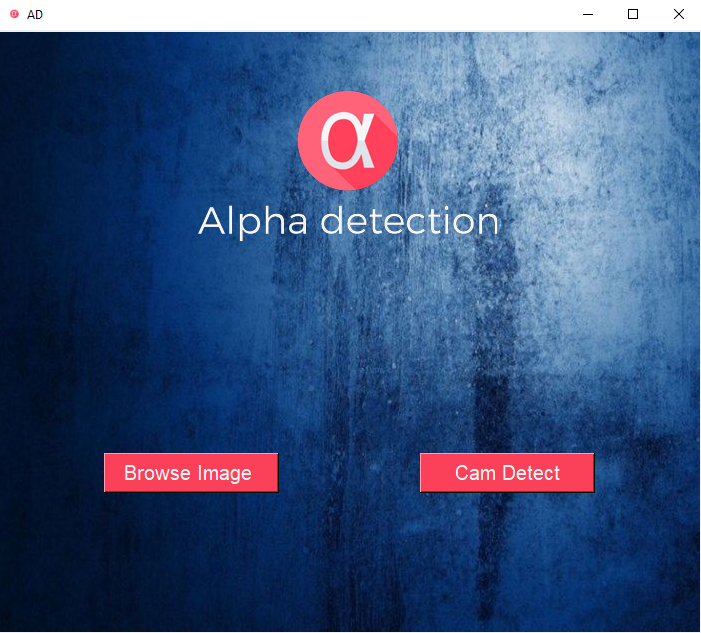
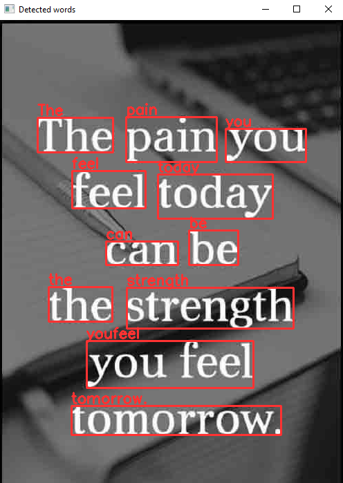
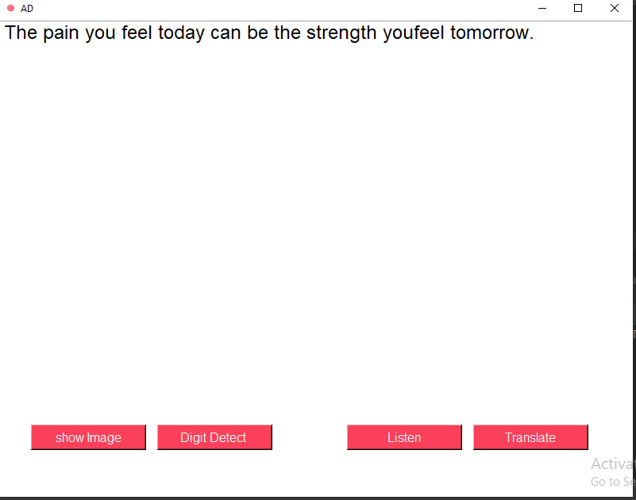

# Handwritten-Text-Recognition Project

##  Team Name: Alpha.

## Team members :

1. Basel Atalla.
2. Bayan Al-khateb.
3. Doa'a Obaidat
4. Sewar Maqableh

## Our project:
Handwritten Text Recognition (HTR) system implemented with TensorFlow (TF) and trained on the IAM off-line HTR dataset. The model takes images of single words or text lines (multiple words) as input and outputs the recognized text.

## Running the Application:
- download Tesseract from [Tesseract](https://tesseract-ocr.github.io/tessdoc/Downloads.html)
- Open the project by PyCharm
- Add these packages :
   - OpenCv
   - Pillow
   - pytesseract
   - pyttsx3
   - time
   - textblob
   - playsound
   - random
   - gtts

- run the program from PyCharm
## Wireframe:

## User Stories:
1. AS a user I want my hand written to be recognized by computer.

 2. As a user I  want to upload image of hand written paper so i can use it as txt or word document.

 3. As a user I  want to know correction probability of my hand text recognision.

 4. As a user I  want a to access the app using GUI.

5. As a user I want my recognised text to be in txt format.

## Management Tools:
[Trello](https://trello.com/b/vLfNmNUC/htr)

## Software Requirements:
### Vision:
  our product for text converting from image to txt format.
  pain point: it will be vary helpfull for university students and for speach recognession.
   
### Scope (In/Out):
- In:
    - the model will take an image of a single word and convert it to text.
    - the model will take an image of a single line and convert it to text.

- Out:
    - converted text of a word or single line.
    - correction Propability.

### The MVP:
- text of recognised text for a word or an image.
- charecter error or correction Propability.

### Data Flow:
 the user has to provide an image of handwritten text to the app and the app will convert it to digital text 
 and put it in text file.

### project version: 

version: 1.0.0 

## Resources
- [Text Detection with open-cv Tutorial](https://youtu.be/6DjFscX4I_c)

- [Handwriting Recognission Tutorial](https://www.pyimagesearch.com/2020/08/24/ocr-handwriting-recognition-with-opencv-keras-and-tensorflow/)